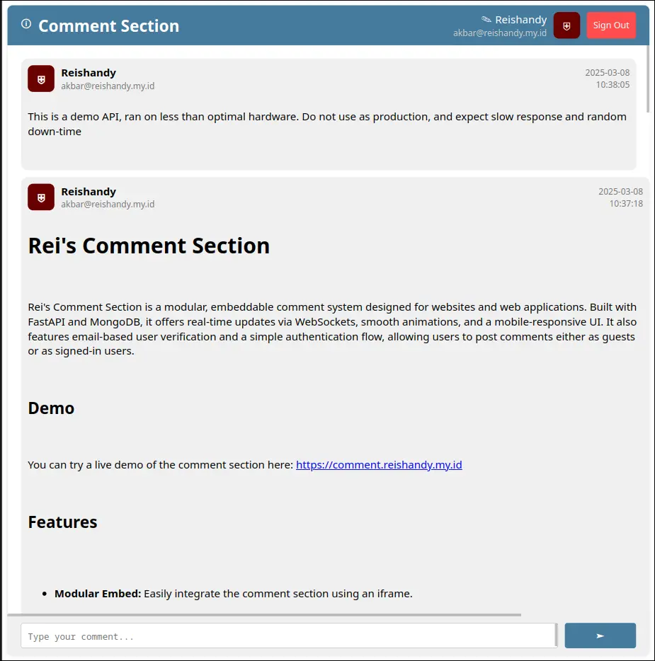

# Rei's Comment Section

Rei's Comment Section is a modular, embeddable comment system designed for websites and web applications. Built with FastAPI and MongoDB, it offers real-time updates via WebSockets, smooth animations, and a mobile-responsive UI. It also features email-based user verification and a simple authentication flow, allowing users to post comments either as guests or as signed-in users.

 

## Demo

You can try a live demo of the comment section here: [https://comment-section.reishandy.my.id](https://comment-section.reishandy.my.id)

## Features

- **Modular Embed:** Easily integrate the comment section using an iframe.
- **Real-Time Updates:** Receive new comments instantly with WebSocket support.
- **Smooth Animations:** Enjoy a modern, animated interface.
- **Mobile Responsive:** Works well on any device.
- **Email Verification:** Secure user authentication via email verification.
- **User Customization:** Change username and display details.

## Caveats

- **Limited Features:** 
  - Currently, the ability to delete or edit comments is not available.
- **Identification:** 
  - Uses the URL path to identify different comment sections (e.g., `example.com/index.html`).
- **Demo Limitations:**
  - The demo API is minimal and might be unavailable at times.
- **Email Sender:** 
  - The email sender function is hardcoded and should be modified to integrate with your own email service.
- **Database:** 
  - MongoDB is used for storage; ensure you have an instance running and properly configured.

## Usage

### Embedding the Comment Section

To embed the comment section on your webpage, insert an iframe into your HTML:

```html
<iframe src="https://comment-section.reishandy.my.id" width="100%" height="100%" frameborder="0"></iframe>
```

Make sure to replace `https://comment-section.reishandy.my.id` with your actual deployment URL.

### API Endpoints

- **GET /**  
  Returns the HTML embed code for the comment section.

- **GET /js**  
  Serves the JavaScript file required for the comment section UI.

- **POST /token**  
  Initiates the email verification process.  
  **Body:**  
  ```json
  {
    "email": "user@example.com"
  }
  ```

- **POST /verify**  
  Verifies the user using a verification code received via email and returns an access token.  
  **Body:**  
  ```json
  {
    "email": "user@example.com",
    "verification_code": "123456"
  }
  ```

- **GET /user**  
  Retrieves user information if a valid access token is provided.

- **PUT /user**  
  Changes the username of the signed-in user.  
  **Query Parameter:** `new_username`

- **POST /comment/{location}**  
  Posts a comment to the specified location.  
  **Body:**  
  ```json
  {
    "comment": "Your comment here"
  }
  ```

- **GET /comment/{location}**  
  Retrieves comments for the given location. Supports pagination and sorting.

- **WebSocket /comment/{location}**  
  Provides real-time comment updates.

> **Note:** The `{location}` parameter in the endpoints is used to distinguish different comment sections (for now, I'm using the page URL as an identifier).

## Installation

### Prerequisites

- **Python 3.8+**
- **MongoDB:** A running MongoDB instance.
- **FastAPI** and **Uvicorn:** For serving the API.
- **Other dependencies:** See [requirements.txt](#) (if available) or install via pip as needed.

### Setup Steps

1. **Clone the Repository:**

   ```bash
   git clone https://github.com/Reishandy/FastAPI-Comment-Section.git
   cd reis-comment-section
   ```

2. **Create and Activate a Virtual Environment:**

   ```bash
   python -m venv venv
   source venv/bin/activate  # Linux/macOS
   venv\Scripts\activate     # Windows
   ```

3. **Install Dependencies:**

   ```bash
   pip install -r requirements.txt
   ```

4. **Configure Environment Variables:**

   Create a `.env` file in the project root with variables similar to:

   ```env
   MONGODB_USERNAME=your_mongodb_username
   MONGODB_PASSWORD=your_mongodb_password
   MONGODB_DATABASE=your_database_name
   MONGODB_HOST=localhost
   MONGODB_PORT=27017

   # Token and code expiration settings (optional overrides)
   ACCESS_TOKEN_EXPIRATION_DAYS=30
   VERIFICATION_CODE_EXPIRATION_MINUTES=10
   CLEANUP_INTERVAL_SECONDS=86400
   ```

5. **Update Email Sender Function:**

   In `database.py`, modify the `send_verification_email` function to use your preferred email service (SMTP, third-party API, etc.).

6. **Run the Application:**

   ```bash
   uvicorn app.main:app --reload
   ```

### Optional: Docker Installation

You can also deploy this project using Docker for easier setup.

1. **Change CMD in Dockerfile:**

   Modify the --host and --port arguments in the `CMD` instruction of the `Dockerfile` to match your deployment configuration.

   ```Dockerfile
   CMD ["uvicorn", "app.main:app", "--host", "<server ip>", "--port", "<server port>"]
   ```

1. **Build the Docker image:**
   ```bash
   docker build -t comment-section-api .
   ```

2. **Run the Docker container:**
   ```bash
   docker run -d --name comment-section-api-container --network host --restart always comment-section-api
   ```

> **Note:** Ensure that your `.env` file is correctly configured and available in the same directory. (See [Setup Steps](#setup-steps))

## Contributing

Contributions are welcome! If you have ideas for new features or improvements (such as comment deletion or editing), please fork the repository and create a pull request.

## 📄 License

This project is licensed under the AGPL-3.0 License - see the [LICENSE](LICENSE) file for details.

## 🙏 Credits

Created by [Reishandy](https://github.com/Reishandy)